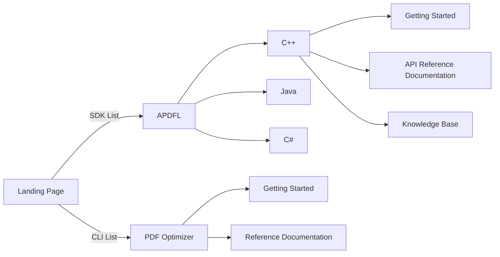

# 2023 Datalogics Website reboot

## ''Dev'' site layout

Generally the layout should be something like this

API Reference Documentation for various language interfaces needs to have a
versioning mechanism. APIs change, and when a parameter is added to a function
call, that happens in a specific version, and the documentation changes to
reflect that. We plan to have this website the primary place where documentation
resides, so it's important to make it easy for users to select the version of
the product they are using.

[Example of versioned documentation](https://cmake.org/cmake/help/latest/)

Another simple requirement is that we generate the API references on disk, and
then copy them to the site with the ability to automate (ssh keyfile
authentication for devauto should be sufficient to allow this - or any other
implementation that resolves this need).
